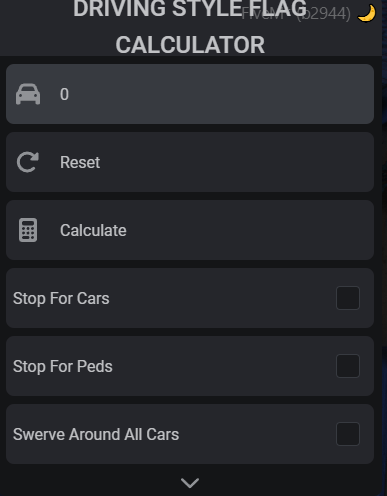

# don-drivingstyle_calc

An In-Game Tool for Calculating Driving Style Flags.

## Table of Contents

- [don-drivingstyle\_calc](#don-drivingstyle_calc)
  - [Table of Contents](#table-of-contents)
    - [Credits](#credits)
    - [Preview](#preview)
    - [Installation](#installation)
      - [Dependencies](#dependencies)
      - [Initial Setup](#initial-setup)
    - [Usage](#usage)
    - [Locales](#locales)
    - [Support](#support)

### Credits

- [DurtyFrees' Data Dumps](https://github.com/DurtyFree/gta-v-data-dumps) for the driving style flags.
- [Vespura's Driving Style Calculator](https://vespura.com/fivem/drivingstyle/) for the inspiration on the Driving Style Calculator.

### Preview



### Installation

#### Dependencies

- [ox_lib](https://github.com/overextended/ox_lib)

#### Initial Setup

- Always use the latest FiveM artifacts (tested on 6683), you can find them [here](https://runtime.fivem.net/artifacts/fivem/build_server_windows/master/).
- Download the latest release from GitHub [here](https://github.com/DonHulieo/don-drivingstyle_calc/releases).
- Extract the contents of the zip file into your resources folder, into a folder which starts after `ox_lib`` or;
- Ensure the script in your `server.cfg` after `ox_lib` or the folder that contains `ox_lib` is ensured.
- Configure both the globals `Config.Command` and `Config.UserLevel` before starting the script, to ensure correct startup and commands are set to your liking.

```lua
Config.Command = 'df_calc'
Config.UserLevel = 'group.admin'
```

- `Config.Command` string, the command to use to open the menu.
- `Config.UserLevel` string, the ACE permission level required to open the menu.

### Usage

- Use the `Config.Command` to open the menu, select the flags you want to test and press `Calculate` to get the results.

### Locales

- The locales are located in the `locales` folder, you can add new locales by copying the `en.lua` file and translating it.
*If you do translate it, please make a pull request so I can add it to the repository.*

### Support

- Join my [discord](https://discord.gg/tVA58nbBuk) and use the relative support channels.
  